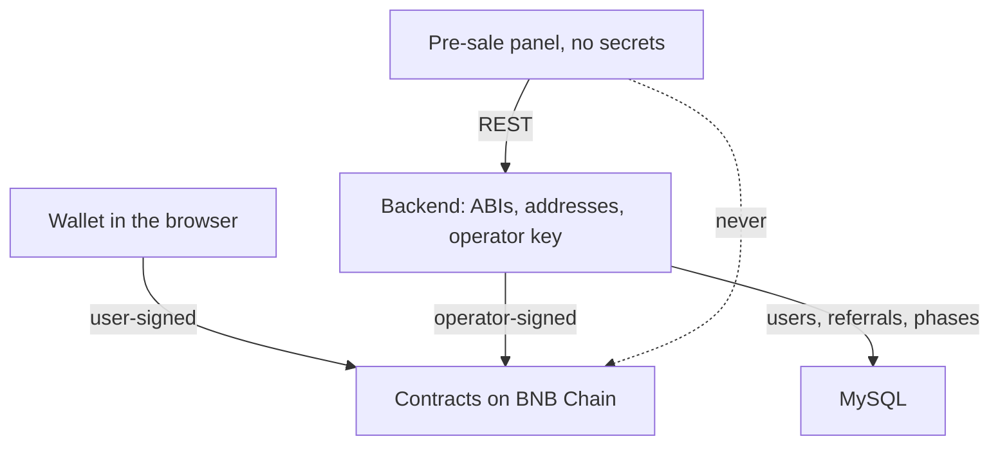

Gold Rush was an NFT game built to promote a gold-backed token issued by the same group. Players
bought a miner character with one token, mined a second token to level up and equip, traded
miners, and had a small chance of receiving the gold-backed token. Contracts targeted BNB Chain
through Hardhat with upgradeable proxies. I wrote the backend that owned every contract call, the
MySQL schema for off-chain state, and the pre-sale panel. The game was paused in 2022-05 and
never launched.

## Context

A Next.js pre-sale panel with referral reporting ran ahead of the game. Contracts were being
written at the same time as the product. Operator actions such as minting and pre-sale
allocation needed a server-side key and an audit trail; user actions needed a wallet.

## Constraints

- Front-end code and the pre-sale panel must not embed private keys or call the chain directly.
- Rules that need trust (mining timers, claimable balances) live on chain. Everything else
  (profiles, referrals, sale phases) lives in MySQL.
- Chain reads are slow and rate-limited. The panel must not block on them.
- A small team, with contracts changing under the product. [CONFIRM: team size and your share
  of the Solidity]

## The alternative on the table

The common dapp pattern: a wallet-connected front end that calls contracts directly. That is fine
for transactions the user signs and wrong for anything the operator signs. Mirroring all chain
state into MySQL through an indexer was the other option; it is over-built before launch and
creates a second source of truth for balances before there are users.

## Decision

A Node.js and TypeScript backend owns every contract interaction through Ethers and Web3: it
holds ABIs and addresses per network, signs operator transactions, and exposes REST endpoints
the product calls. MySQL holds users, referrals, sale phases and off-chain game state.
User-signed actions go through the wallet in the browser. Operator actions never do.

## What it cost

- The backend is a trusted intermediary. If it lies, the UI lies. Accepted, because the operator
  already controls the contracts.
- Two places to update when a contract changes: the ABI in the backend and the contract on chain.
  Versioned ABIs kept that manageable.

## Outcome

Never launched. The product was paused in 2022-05 during the wave of NFT-game collapses, and I
moved on. What it proved: the boundary let the pre-sale panel deploy to a public host with no
secrets in it, and contract upgrades did not require front-end releases.
[CONFIRM: any testnet addresses that can be linked as evidence]
