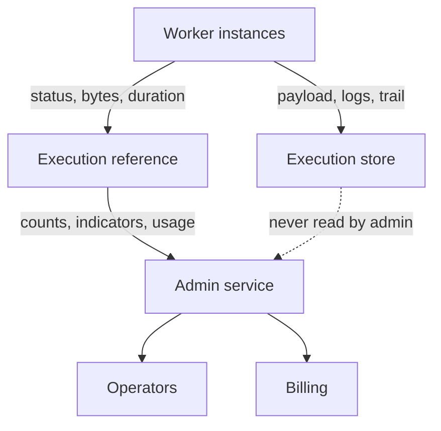

The admin service of Integra.Sky had to answer operator and billing questions across every
customer space: how many executions are running now, how many succeeded or failed per space this
month, how much billable data each space moved, which plan applies. It answered them against the
execution store, the hottest write path in the platform. I moved every one of those reads onto a
slim `execution-reference` collection. The service serves billing plans, usage and running-execution
indicators from it today.

## Context

Customer flows run on worker instances, and every run writes an execution document with its
payload, logs and component trail. Operators and billing needed aggregate answers over those
runs: counts by status, grouped by space, filtered by integration and flow, plus bytes moved and
duration for invoicing. Reading the execution collection for this put reporting load on the same
replica set the workers write to.

## Constraints

- The execution collection is the hottest write path in the platform. Admin queries must not
  compete with it.
- Counts must be groupable by space and filterable by status, integration and flow, with
  pagination and sorting.
- Billing needs bytes moved and duration per execution, not the payload.
- The service had to keep the platform's existing shape (Express, MongoDB, Redis, dependency
  injection, one use case per folder) so other engineers could keep working in it.
- No downtime and no migration of the execution store.

## The alternative on the table

Aggregate directly over the execution collection with better indexes. Indexes help the reads,
but the aggregation still scans documents that carry payloads and logs, and the cost lands on the
replica set the workers depend on. A nightly copy into a reporting database was the other
option. "Running now" and "failed in the last hour" are operational questions that a day-old copy
cannot answer, and a second datastore is an operational surface the team did not have capacity
to own.

## Decision

Serve indicators, counts and usage from a slim `execution-reference` collection: one document per
execution carrying only space, integration, flow (id and name, denormalized), status, instance,
timestamps, billable bytes, duration and the last component. Admin use cases read only this
collection through a repository interface, with one shared query handler for filtering,
pagination and sorting.

[CONFIRM: did you design the reference collection and its writer, or did the collection exist
and you moved the read path onto it?]

## What it cost

- Two writes per execution instead of one. The reference can lag the execution.
  [CONFIRM: how the writer works: same operation, event, scheduler?]
- Denormalized names go stale if a flow or space is renamed. Accepted, because reports are
  historical and renames are rare.
- Another collection to index and retain. [CONFIRM: retention policy]

## Outcome

In production since [CONFIRM: month]. Billing plans, per-space usage, instance data and
running-execution indicators are served by this service. [CONFIRM: any measured effect, such as
admin query latency or load removed from the execution replica set. If there is no measurement,
this paragraph ends here.]
