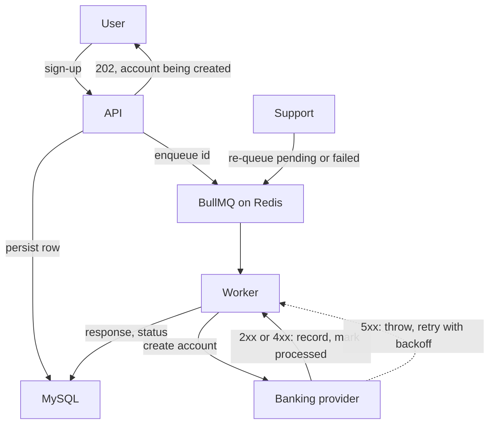

Sign-up created the user's digital bank account with a synchronous call to a banking-as-a-service
provider. The provider was slow and returned server errors on bad days, so sign-ups timed out for
reasons the user could not act on, and support could not see or replay what had happened. I moved
the call onto a persisted BullMQ job with a retry rule and an operator re-queue. It ran in
production from 2021-05 until I left in 2022-05.

## Context

Onboarding a user meant opening an account at the provider. The call lived inside the sign-up
request. When the provider was slow, the request was slow. When it failed, the sign-up failed
with an error that told the user nothing, and there was no record of what had been sent or what
had come back.

## Constraints

- Sign-up must return quickly regardless of provider health.
- Every attempt must be auditable: what was sent, what came back, when.
- Creating an account twice for one user is a real-money mistake. Replays must be safe.
- The API was a monolith on Express, Sequelize and MySQL, with Redis already in use. New
  infrastructure had to justify itself.
- Support staff, not engineers, needed to trigger retries.

## The alternative on the table

Keep it synchronous and raise the timeout, with a retry in the client. That moves the wait onto
the user and multiplies load on a provider that is already failing. A fire-and-forget promise
after responding was the cheap version of async; it loses the attempt on a process restart and
leaves no record for support. A cron job scanning a pending table adds up to a minute of latency
to every sign-up and gives no per-job backoff, concurrency limit or dashboard.

## Decision

Persist a registration row (payload, status, provider response, status code) at sign-up, enqueue
its id on a BullMQ queue backed by the existing Redis, and process it in a separate worker. The
worker loads the row, calls the provider and stores the response. It throws only when the provider
answered with a 5xx, so BullMQ's retry and backoff apply to server faults and never to client
faults: a 4xx is recorded as processed and surfaced to support. Two admin routes re-queue one
registration or every pending or failed one. A re-queue of a row already marked processed is
refused. A queue dashboard is mounted under the admin routes.

## What it cost

- A second process to deploy and monitor: the worker.
- Eventual consistency. The user sees "account being created" instead of an immediate result,
  and the product copy had to change.
- The "already processed" guard is per row, not a provider-side idempotency key. A duplicate row
  created upstream would still be processed once each.

## Outcome

In production from 2021-05. The retry defaults were tuned in 2021-10 after watching the
provider's behavior. Sign-up stopped waiting on the provider, and failed onboardings became
visible and replayable by support instead of silent. [CONFIRM: any counts, such as registrations
processed or failures before and after. If none, this paragraph ends here.]
